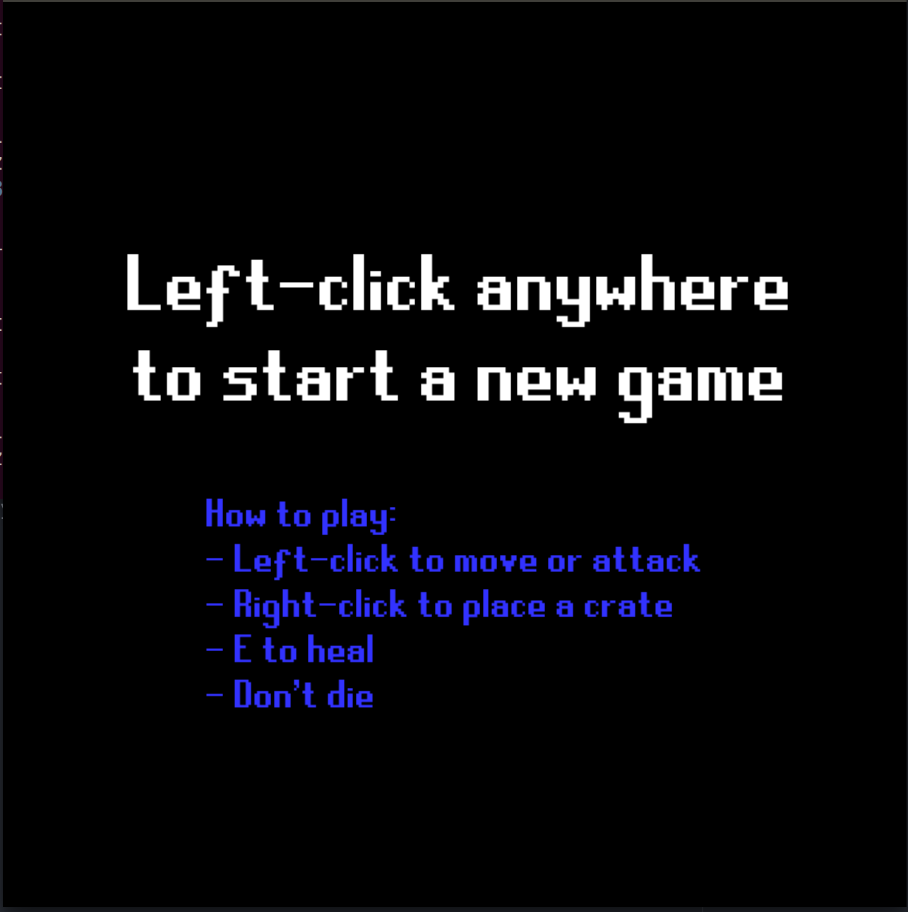
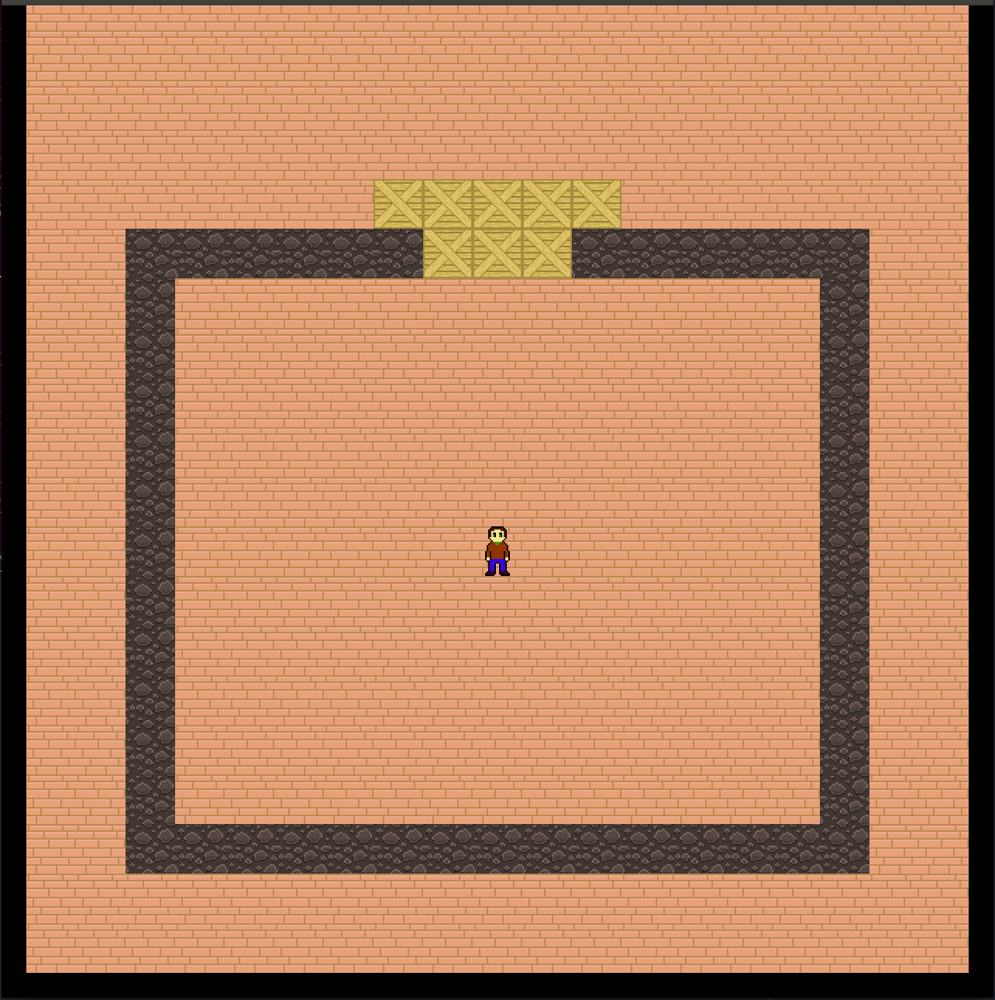
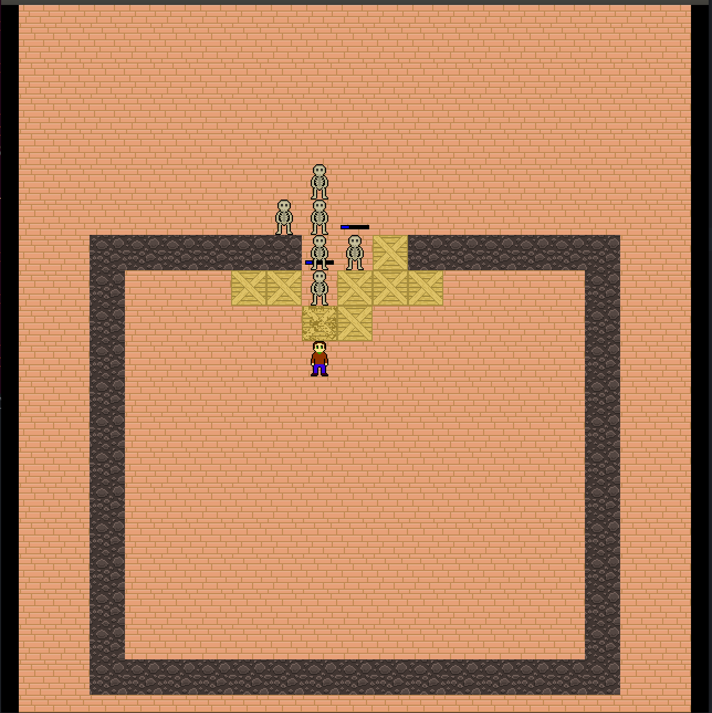

# ludumdare-37
My compo entry for Ludum Dare 37.

This project is not finished, and it will probably never be.  I wasn't very
inspired by the theme, it was my first LD, and I had never used Lua and the
LÖVE game engine.  Needless to say, this was a bad decision :D  Anyway, I still
had fun making this game, but it's not really playable.

If you still want to try it out, you'll need [LÖVE](https://love2d.org/)
installed.  Just `cd` to the root and type:
```bash
$ love src
```

In this game, you play a character in a Hack'n'Slash who can attack enemies
and place crates on the ground.  If you click on a spot and the character can
reach it, it will go there, breaking crates on the way if needed.  The same
goes for enemies, who will chase you.  They spawn from invisible entities on the
map.  Also, if dying isn't your thing, you can heal with `e`.  That's about it!

All the art is by myself.  Some code snippets are taken from other places---in
which case, it's always mentioned in the file.  The sounds have been randomly
generated with [SFXR](http://www.drpetter.se/project_sfxr.html).




